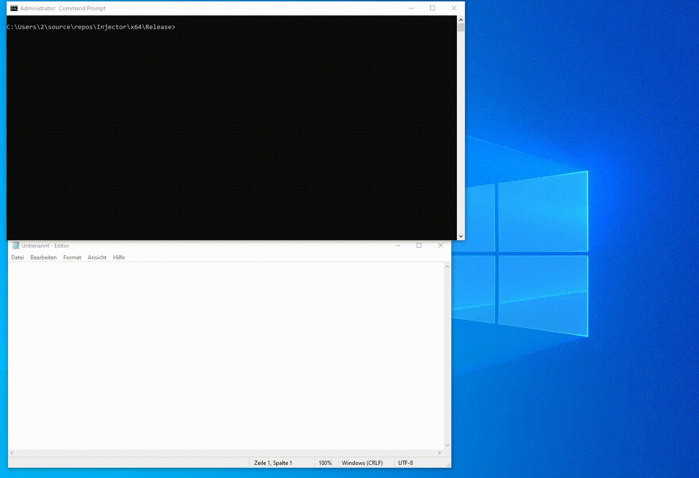

# Kernel-Manual-Map-Injector

# What is this
> This is a kenrel DLL injector using SetWinEventHook to call the Entry Point of the DLL

# Will this work on EAC & BE protected games?
> Yes it will. But dont think that will this be undetected without editing the code

# I need help what do I do ?
> You can add me on discord kidra#6986
# Showcase

# Credits

[Kernel Driver used](https://github.com/mactec0/Kernelmode-manual-mapping-through-IAT)

[Shellcode (edited)](https://github.com/TheCruZ/Simple-Manual-Map-Injector)
